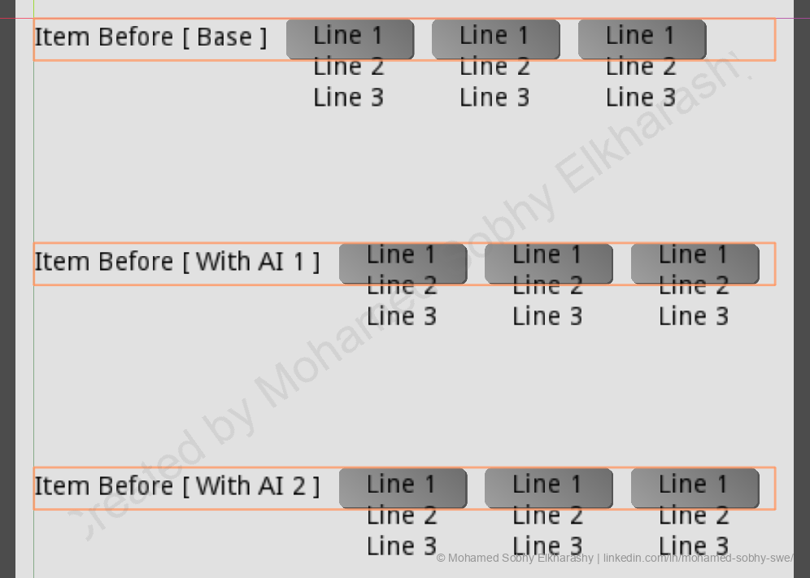
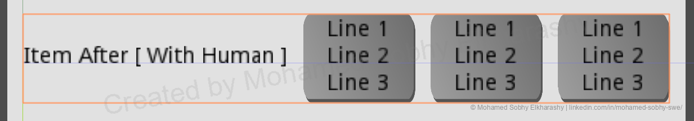

# Complex Game Engine Node Tree Manipulation: "Non-Container Resize On TextWrap" Demo

This repository demonstrates a specific case study in **AI-Assisted Programming limitations**. 

It compares the failed solutions generated by leading AI models against the final, working solution engineered by a talented human developer. The objective was a complex UI task in **Godot Engine 3.6.1** involving dynamic non-container resizing.

## 📂 Project Overview

**The Goal:**  
Create a responsive UI element where:
1. A `Label` (Child) wraps text dynamically.
2. Its parent `TextureButton` expands vertically to fit the new text height.
3. The grandparent `VBoxContainer` adjusts the layout accordingly.

**The Challenge:**  
In Godot 3.x, `TextureButton` is not a `Container` type node. It does not automatically propagate child size changes to its own minimum size, often leading to text overflowing/clipping or layout overlap.

---

## 🧪 The Experiment

I provided the prompt to multiple leading AI models (LLMs).

> **Prompt:** "I have a VBoxContainer (RowItem) that contains a TextureButton (ButtonAction) which has a child Label (Label). When the label text wrap and lets the label size y longer, the parent TextureButton and VBoxContainer doesn't resize. Plz advise"

### ❌ The AI Solutions (Failed)

Leading AI models provided solutions that sounded confident but failed in practice.

**Attempt 1 (Property Tweaking):**
*   **Suggestion:** Relied heavily on setting `Anchors Preset` to Full Rect and `Expand` to true.
*   **Result:** The text wrapped, but the button remained small, causing the text to bleed over other UI elements. The AI failed to understand that `TextureButton` ignores child size by default.

**Attempt 2 (Script Overrides):**
*   **Suggestion:** Complicated overrides of `get_minimum_size()` and manual signal connections to `queue_sort()`.
*   **Result:** Created an infinite resize loop in some cases, or failed to trigger the parent container update correctly. It was an over-engineered solution that introduced performance overhead.

### ✅ The Talented Human Solution (Working)

The final solution required a specific understanding of Godot's node structure and types, which leads to non-container sizing inheritance that the AI missed. 

*(See the `After_Solution` scene in the project files for the code)*

---

## 📸 Visual Comparison

### Before (AI Solutions)
*Notice how the container fails to expand, causing the text to overlap the buttons below.*

### After (Human Correction)
*The container respects the text wrap and pushes neighboring elements down correctly.*

---

## 📊 Analysis: The "AI Ceiling"

Why did the AI fail at a task that seems standard?

1.  **Spatial Reasoning Deficit:** AI models process text, not geometry. They struggle to visualize the hierarchy of nested containers.
2.  **Lack of Visual Feedback:** A human dev runs the game, sees the distortion, and adjusts. The AI works "blind," assuming its logic is sound because the syntax is correct.
3.  **Project Context:** The AI doesn't know the full architecture of the project (e.g., how this specific scene interacts with the rest of the UI theme).

**Verdict:**  
AI was useful for generating the **boilerplate** (saving 50 ~ 70 % of total minutes of typing), but the **critical thinking** required to solve the architectural constraint took human expertise.

## 🛠️ Installation

1. Clone this repository.
2. Import the `project.godot` file into **Godot Engine 3.6.1** (Standard version).
3. Run the `MainTest.tscn` scene.

## Disclaimer

> **Attribution:** The concepts, graphs, and breakdown in this repository are part of a research series by **Mohamed Sobhy Elkharashy**. If you share this data or the "Complexity vs Autonomy" graph, please link back to this repo or my LinkedIn profile: <https://www.linkedin.com/in/mohamed-sobhy-swe/>.

## License
This repository uses a **dual‑license structure**:

- **Concepts, graphs, documentation, and README** → Licensed under **Creative Commons Attribution‑NonCommercial 4.0 (CC BY‑NC 4.0)**.
- **Source code** → Licensed under the **MIT License**.

See the [LICENSE](LICENSE) file for full details.

Copyright (c) 2025 Mohamed Sobhy Elkharashy